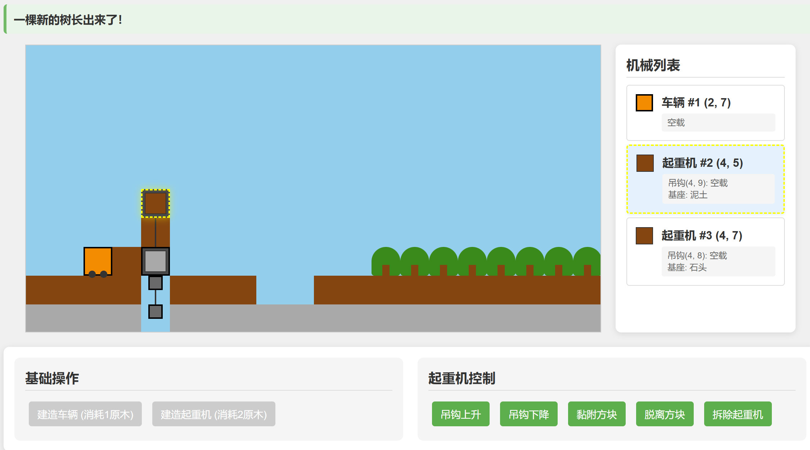

# 方块工匠：远古机关师

这是一款融合建造与资源管理的古代机械游戏。您需要通过操控车辆和起重机来收集资源、建造设施，在二维世界中挑战各种地形。



## 功能特性

- **动态二维世界**：与不同类型的方块互动，包括泥土、石头和树木
- **机械控制**：操作具有独特能力的车辆和起重机
- **资源管理**：砍伐树木获取原木以建造新的机械
- **物理模拟**：体验真实的移动限制和支撑面机制
- **机械互动**：在机械、地形和世界之间装载和卸载方块

## 游戏机制

### 方块类型
- **空气**：机械可以穿过的空间
- **泥土**：基本地形方块，可作为支撑面
- **石头**：坚固的地形方块，可作为支撑面
- **树木**：可以砍伐获取原木资源
- **原木**：用于创建车辆和起重机的资源

### 机械

#### 车辆
- 成本：1个原木
- 可以在支撑面上水平移动
- 如果地形允许，可以爬升或下降一个方块
- 一次可以携带一个方块
- 可以穿过未装载的起重机吊钩和基座

#### 起重机
- 成本：2个原木
- 有固定的基座和可移动的吊钩
- 吊钩可以上下移动
- 基座和吊钩都可以持有一个方块
- 可以在世界、车辆和其他起重机之间传输方块

### 移动规则
- 车辆需要下方有支撑（地形或装载状态的起重机基座）
- 如果有适当的地形，车辆可以爬升或下降一个方块
- 车辆可以穿过未装载的起重机组件
- 吊钩在未装载时可以自由移动，但装载时无法穿过固体物体

### 资源系统
- 砍伐树木提供原木
- 原木用于创建新的车辆（1个原木）和起重机（2个原木）
- 拆除机械将返还其原木成本
- 树木会在现有树木附近自然生长
- 每10次操作后，树木有机会在现有树木附近生长
- 树木生长概率随现有树木数量增加而提高

## 操作控制

### 车辆控制
- 向左移动：A
- 向右移动：D
- 从左侧装载：Q
- 从右侧装载：E
- 向左侧卸载：Z
- 向右侧卸载：C
- 智能装载（优先装载树木）：R
- 智能卸载（同方向）：F
- 智能卸载（反方向）：V
- 拆除：X

### 起重机控制
- 吊钩上移：W
- 吊钩下移：S
- 附着方块：R
- 分离方块：F
- 拆除：X（需要吊钩回到基座位置且无装载）

## 开始游戏

### 前提条件
- 现代网络浏览器（Chrome、Firefox、Safari、Edge）

### 安装
1. 克隆仓库：
   ```
   git clone https://github.com/ZoukiLi/block-craftsman-ancient-mechanic.git
   ```
2. 在浏览器中打开`index.html`文件

### 在线游玩
访问[游戏网站URL]直接在浏览器中玩游戏，无需安装。

## 游戏界面

- **游戏世界**：显示方块、车辆和起重机的主要游戏区域
- **资源面板**：显示可用的原木资源
- **机械列表**：显示所有机械及其当前状态
- **控制面板**：包含用于创建机械和控制选定机械的按钮
- **消息区域**：提供游戏操作的反馈
- **操作计数器**：跟踪已执行的操作数量

## 高级机制

- **机械选择**：点击机械以选择它并显示其控制项
- **机械创建**：使用原木资源创建车辆和起重机
- **树木生长**：树木会在现有树木附近偶尔生长
- **机械重叠**：指示器显示机械何时重叠，这可能会影响功能
- **安全检查**：物理安全系统防止会导致车辆失去支撑的操作
- **智能装载/卸载**：智能装载会优先寻找树木，其次根据移动方向选择装载位置

## 开发技术

本游戏使用以下技术构建：
- HTML5
- CSS3
- 原生JavaScript

## 许可证

本项目采用MIT许可证 - 详情请参阅LICENSE文件。

## 致谢

- 灵感来源于各种基于方块和建筑模拟游戏
- 特别感谢所有贡献者和测试者
